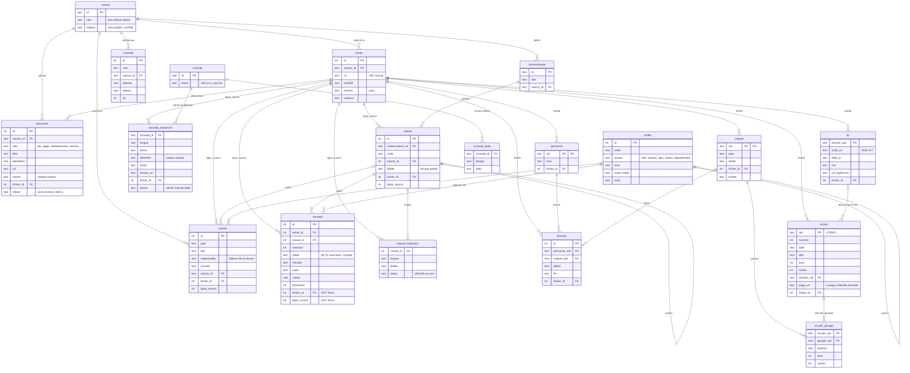

# Schéma de la base (`comptes.sqlite`)

Généré à partir de `db/schema.sql` le 2026-10-27. Toute ligne de donnée remonte à `fichier` (le brut collecté, avec son
sha256), puis à `source`.

```mermaid
erDiagram
    source ||--o{ fichier : "collecté en"
    source ||--o{ document : "cité par"
    source ||--o{ nomenclature : "définit"
    source ||--o{ controle : "vérifiée par"
    source ||--o{ lacune : "concerne"

    fichier ||--o{ montant : "ligne_source"
    fichier ||--o{ noeud : "ligne_source"
    fichier ||--o{ noeud_traduction : "ligne_source"
    fichier ||--o{ concept_traduction : "ligne_source"
    fichier ||--o{ lacune : "ligne_source"
    fichier ||--o{ document : "relevé dans"
    fichier ||--o{ organe : "entrée"
    fichier ||--o{ personne : "entrée"
    fichier ||--o{ fonction : "entrée"
    fichier ||--o{ scrutin : "entrée"
    fichier ||--o{ loi : "entrée"

    nomenclature ||--o{ noeud : "contient"
    noeud ||--o{ noeud : "parent"
    noeud ||--o{ noeud_traduction : "traduit"
    noeud ||--o{ montant : "poste"
    entite ||--o{ montant : "dépense de"
    entite ||--o{ entite : "parent"
    noeud |o--o{ lacune : "poste"
    entite |o--o{ lacune : "territoire"

    concept ||--o{ concept_traduction : "terme et définition"
    concept ||--o{ concept_alias : "formes reliées"

    personne ||--o{ fonction : "exerce"
    organe ||--o{ fonction : "dans"
    organe ||--o{ scrutin_groupe : "groupe"
    scrutin ||--o{ scrutin_groupe : "vote des groupes"
    loi |o--o{ scrutin : "dossier qui le cite"

    source {
        text id PK
        text titre "titre officiel relevé"
        text editeur "nom publié, contrôlé"
    }
    fichier {
        int id PK
        text source_id FK
        text url "URL exacte"
        text sha256
        text chemin "raw/..."
        text collecte
    }
    document {
        int id PK
        text source_id FK
        text role "jeu, page, metadonnees, licence..."
        text titre
        text identifiant
        text url
        text extrait "citation exacte"
        int fichier_id FK
        text releve "où le champ a été lu"
    }
    montant {
        int id PK
        int entite_id FK
        int noeud_id FK
        int exercice
        text stade "plf, lfi, execution, compte"
        text mesure
        text unite
        real valeur
        int provisoire
        int fichier_id FK "NOT NULL"
        int ligne_source "NOT NULL"
    }
    noeud {
        int id PK
        text nomenclature_id FK
        text code
        int parent_id FK
        text libelle "tel que publié"
        int fichier_id FK
        int ligne_source
    }
    noeud_traduction {
        int noeud_id FK
        text langue
        text libelle
        text statut "officielle ou non"
    }
    nomenclature {
        text id PK
        text titre
        text source_id FK
    }
    entite {
        int id PK
        text code
        text niveau "etat, secteur_apu, region, departement"
        text nom
        text code_insee
        text siren
    }
    lacune {
        int id PK
        text type
        text titre
        text responsable "éditeur de la source"
        text constat
        text source_id FK
        int fichier_id FK
        int ligne_source
    }
    concept {
        text id PK
        text statut "cite ou a_sourcer"
    }
    concept_traduction {
        text concept_id FK
        text langue
        text terme
        text definition "citation exacte"
        text statut
        text source_url
        int fichier_id FK
        text releve "relevé manuel daté"
    }
    concept_alias {
        text concept_id FK
        text langue
        text alias
    }
    controle {
        int id PK
        text nom
        text source_id FK
        real attendu
        real obtenu
        int ok
    }
    organe {
        text uid PK "PO..."
        text type
        text libelle
        int fichier_id FK
        text entree
    }
    personne {
        text uid PK "PA..."
        text nom
        int fichier_id FK
    }
    fonction {
        int id PK
        text personne_uid FK
        text organe_uid FK
        text debut
        text fin
        int fichier_id FK
    }
    scrutin {
        text uid PK "VTANR..."
        int numero
        text date
        text titre
        int pour
        int contre
        text dossier_uid FK
        text page_url "si page collectée prouvée"
        int fichier_id FK
    }
    scrutin_groupe {
        text scrutin_uid FK
        text groupe_uid FK
        text position
        int pour
        int contre
    }
    loi {
        text dossier_uid PK
        text code_loi "2025-127"
        text date_jo
        text nor
        text url_legifrance
        int fichier_id FK
    }
```
